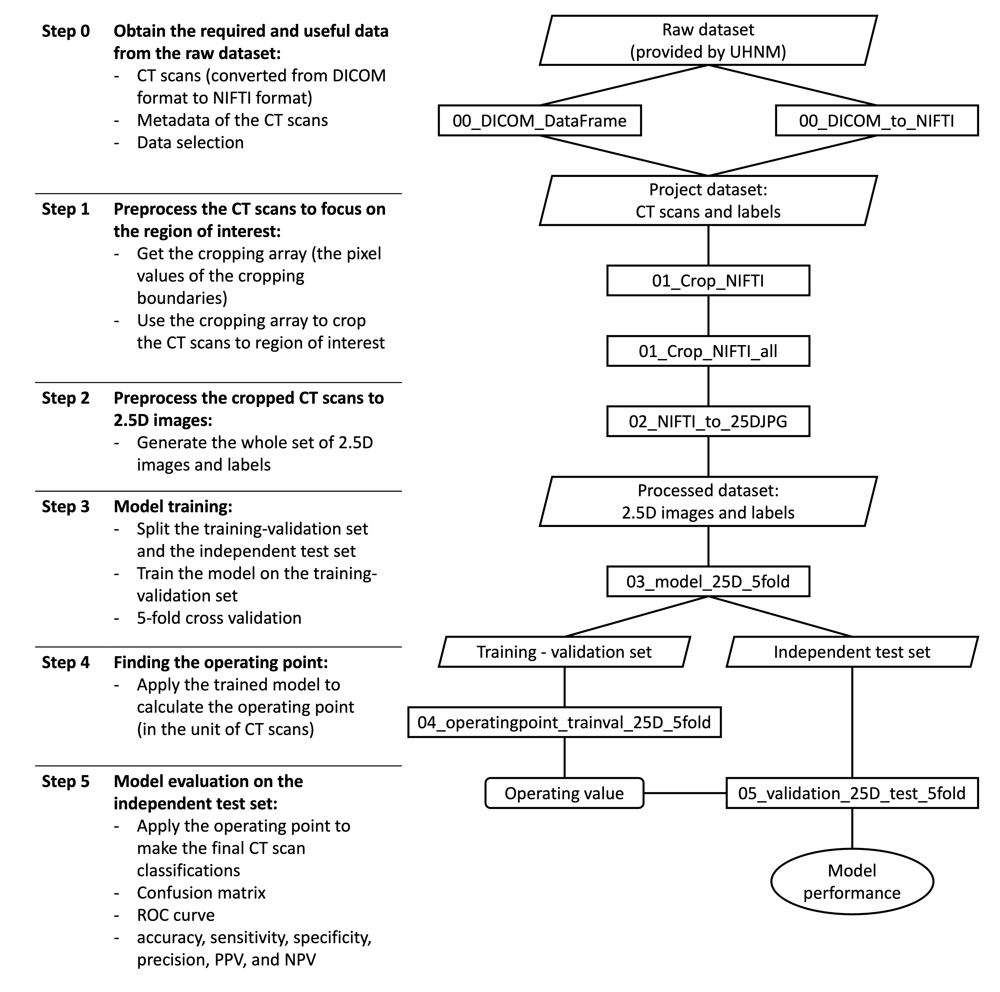

# NHS AI Lab Skunkworks project: Detecting adrenal lesions in CT scans

> A pilot project for the NHS AI (Artificial Intelligence) Lab Skunkworks team, Detecting adrenal lesions on CT scans seeks to augment the detection of adrenal lesions in CT scans using computer vision and deep learning.

Detecting adrenal lesions in CT scans was selected as a project in {DATE SELECTED} following a succesful pitch to the AI Skunkworks problem-sourcing programme.

## Intended Use

The work contained in this repository is experimental research and is intended to demonstrate the technical validity of applying deep learning models to CT scans datasets in order to detect adrenal lesions. It is not intended for deployment in a clinical or non-clinical setting without further development and compliance with the [UK Medical Device Regulations 2002](https://www.legislation.gov.uk/uksi/2002/618/contents/made) where the product qualifies as a medical device.

## Data Protection

This project was subject to a Data Protection Impact Assessment (DPIA) and Data Processing Agreement (DPA), ensuring the protection of the data used in line with the [UK Data Protection Act 2018](https://www.legislation.gov.uk/ukpga/2018/12/contents/enacted) and [UK GDPR](https://ico.org.uk/for-organisations/dp-at-the-end-of-the-transition-period/data-protection-and-the-eu-in-detail/the-uk-gdpr/). No data or trained models are shared in this repository.

## Background

Autopsy studies reveal a statistic that there are as many as 6% of the population, who died of natural causes, were not aware that they had an adrenal lesion. Approximately, in the UK, adrenal lesion affect 50,000 patients annually. While some lesions are benign, others can be malignant and require further evaluation and treatment. 

Currently, the detection of adrenal lesions relies on manual analysis by radiologists, which can be time-consuming and subjective. There is a demand for more efficient methods to detect these lesions. This project aims to address this need by using computer vision and deep learning techniques to automatically detect adrenal lesions in CT scans.

## Overview

This repository contains a series of notebooks which implement the data science pipeline for the model development. We developed a 2.5D deep learning binary classification model to perform the adrenal lesion detection on 3D CT scans. The preparation of 2.5D images from the 3D CT scans, the model architecture, and the model training process for our 2.5D model is summarised below:



> Further details of the model and results of the analysis are available in the [related publication]().

## Directory structure

The directory structure of this project includes data stored outside of the git tree. This is to ensure that, when coding in the open, no data can accidentally be committed to the repository through either the use of `git push -f` to override a `.gitignore` file, or through ignoring the `pre-commit` hooks.

The structure of this repository is as follow: 
```
repository-directory
├── 00_DICOM_DataFrame.ipynb
├── 00_DICOM_to_NIFTI.ipynb
├── 01_Crop_NIFTI.ipynb
├── 01_Crop_NIFTI_all.ipynb
├── 02_NIFTI_to_25DJPG.ipynb
├── 03_model_25D_5fold.ipynb
├── 04_operatingpoint_trainval_25D_5fold.ipynb
├── 05_validation_25D_test_5fold.ipynb
├── README.md
├── docs
│   ├── K110_pipeline.png
│   └── banner.png
├── src
│   ├── util_analysis.py
│   ├── util_data.py
│   ├── util_image.py
│   ├── util_model.py
│   └── util_plot.py
├── requirements.txt
└── models
```
The trained model structures and weights (.h5) are saved in the folder `models`. It is left empty in this repository due to the Data Protection Agreement.

And the raw data directory structure (not included in this repository and not shared) has the following structure:
```
data
├── abnormal
│   ├── patient_1
│   │   ├── DICOM
│   │   │   └── basename_1
│   │   │       └── basename_2
│   │   │           └── basename_3
│   │   │               ├── case_1
│   │   │               │   ├── DICOM_slice_1
│   │   │               │   ├── DICOM_slice_2
│   │   │               │   └── ...
│   │   │               ├── case_2
│   │   │               │   ├── DICOM_slice_1
│   │   │               │   ├── DICOM_slice_2
│   │   │               │   └── ...
│   │   │               └── ...
│   │   └── <other unrelated information>
│   ├── patient_2
│   └── ...
└── normal
    ├── patient_50
    │   ├── DICOM
    │   │   └── basename_1
    │   │       └── basename_2
    │   │           └── basename_3
    │   │               ├── case_1
    │   │               │   ├── DICOM_slice_1
    │   │               │   ├── DICOM_slice_2
    │   │               │   └── ...
    │   │               ├── case_2
    │   │               │   ├── DICOM_slice_1
    │   │               │   ├── DICOM_slice_2
    │   │               │   └── ...
    │   │               └── ...
    │   └── <other unrelated information>
    ├── patient_51
    └── ...
```
The two notebooks, `00_DICOM_DataFrame.ipynb` and `00_DICOM_to_NIFTI.ipynb`, were written to extract required and useful data (for this project use case) from this raw dataset structure. 

## Getting started

> Dataset (CT scans and labels) is not provided in this repository.

1. Clone this repository
2. Install required packages: `pip install -r requirements.txt`
3. Execute notebooks in order (following the pipeline)

There are different tools (notebooks) provided in this repository that suitable different needs to prepare the images and labels (depending on the dataset you intended to work on):
- If your dataset follow the format of the raw data structure stated, execution of the notebooks should start from step 0 (`00_DICOM_DataFrame.ipynb` and `00_DICOM_to_NIFTI.ipynb`).
- If your data is in the form of the project dataset (NIFTI CT scans and labels), you can do the following:
    - execute notebooks starting from step 1 (`01_Crop_NIFTI.ipynb` and `01_Crop_NIFTI_all.ipynb`) to crop your 3D NIFTIs to the region of interest (adrenal glands) .
    - execute notebooks starting from step 2 (`02_NIFTI_to_25DJPG.ipynb`) to prepare the 2.5D JPEG images from the 3D NIFTIs.

## Environment

The codes included in this repository were developed and tested using `Python Version: 3.8.5`. Use of GPU may demonstrates an improvement on the speed performance while training the model (`03_model_25D_5fold.ipynb`) using TensorFlow (Version 2.3.1, see `requirements.txt`). 

## NHS AI Lab Skunkworks

The project is supported by the NHS AI Lab Skunkworks, which exists within the NHS AI Lab at the NHS Transformation Directorate to support the health and care community to rapidly progress ideas from the conceptual stage to a proof of concept.

Find out more about the [NHS AI Lab Skunkworks](https://transform.england.nhs.uk/ai-lab/ai-lab-programmes/skunkworks/).
Join our [Virtual Hub](https://future.nhs.uk/connect.ti/system/text/register) to hear more about future problem-sourcing event opportunities.
Get in touch with the Skunkworks team at [england.aiskunkworks@nhs.net](mailto:england.aiskunkworks@nhs.net).


## Licence

Unless stated otherwise, the codebase is released under [the MIT Licence][mit].
This covers both the codebase and any sample code in the documentation.

The documentation is [© Crown copyright][copyright] and available under the terms
of the [Open Government 3.0][ogl] licence.

[mit]: LICENCE
[copyright]: http://www.nationalarchives.gov.uk/information-management/re-using-public-sector-information/uk-government-licensing-framework/crown-copyright/
[ogl]: http://www.nationalarchives.gov.uk/doc/open-government-licence/version/3/